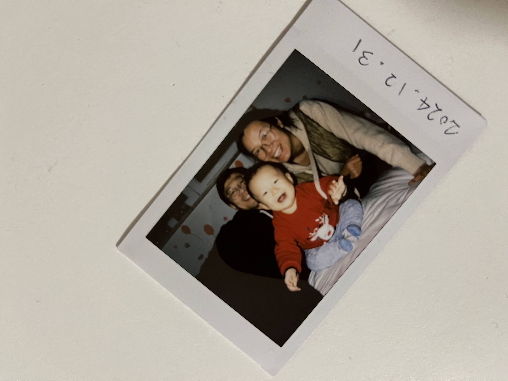

# 新的开始

对我们的小家来说，2024是个好年。年初儿子出生，年中我回到卢森堡工作，结束了三年半的两地奔波。转眼已是年末。上一个十年东奔西走，今年终于有种尘埃落定的感觉。

儿子的到来是巨大的欢喜，有着无穷的期盼。一天觉得他力大无穷是个体育苗子，一天觉得他挥舞工具的神采
是个工程师的材料，还有无限的可能。

当然也体会了当父母的焦虑。刚出生体重轻体温保持不住险些进了温室；直到37天才学会吃母乳；体检；
发烧到睡不着；幼儿园门口撕心裂肺的哭。

感激媳妇，下一个十年会越来越好。

